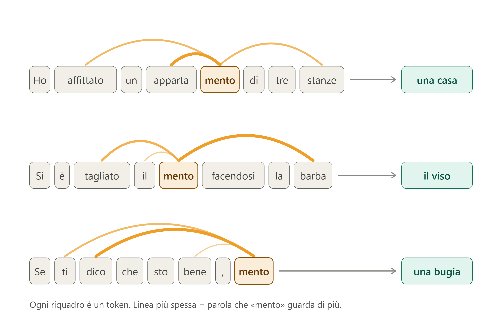
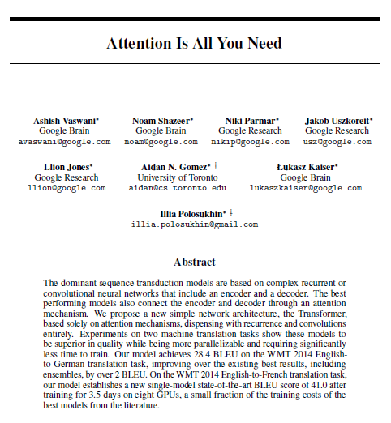

# Pagina informativa sull'IA

1. Perché questa pagina
2. Come funziona
3. Breve storia
4. Speranze
5. Timori
6. Preoccupazioni legate alla vita quotidiana
7. Tentativi di regolamentazione 
8. Glossario

## Perché questa pagina

Il perché è molto semplice: tutti i giorni leggiamo o ascoltiamo decine di notizie sull'Intelligenza Artificiale (IA), allarmi, cifre da capogiro, annunci da "fine del mondo" o, all'opposto, promesse di soluzioni ai grandi problemi del nostro tempo. Ma è molto difficile trovare una fonte che provi a spiegarci cosa c'è davvero "sotto il cofano" (*under the hood* direbbero gli americani). Questa scarsa conoscenza è il terreno migliore per coloro che hanno un forte interesse personale o aziendale nella propagazione di notizie che hanno scarso o nessun fondamento.

La complessità del tema rappresenta certamente un grosso ostacolo. Nell'IA c'è molta matematica e ingegneria informatica, materie per pochi esperti. Ma non è del tutto impossibile cercare di spiegare in modo divulgativo, a grandi linee ovviamente e con esempi molto semplificati, ciò che accade quando discutiamo con Gemini o con ChatGPT. In ogni caso, vale la pena fare un tentativo.
Cercheremo poi di raccontare per grandi linee come è nata l'IA e di riassumere alcuni dei temi che sono oggetto di dibattito quotidiano.

### Avvertenza iniziale

Questa pagina è stata scritta a partire dalla consultazione di diverse pagine web, di chat diverse IA (Gemini, ChatGPT, Claude) e grazie ad un libro di *Stefano Quintarelli* (con *Emil Abirascid*) dal titolo "La bolla dell'intelligenza artificiale" (editore Bollati Boringhieri, settembre 2026), di cui si consiglia la lettura a tutti gli interessati. Il layout della pagina (cioè il codice html e css che c'è dietro quello che state leggendo) è stato scritto da Claude sulla base delle indicazioni fornite dall'autore. Anche le immagini sono state elaborate da Claude.

## Come funziona

Partiamo dalle basi. Detto in maniera estremamente semplificata, l'IA è una elaborazione statistica di frammenti di parole. Non "parole", si badi bene, ma "frammenti" di parole. Obiettivo: costruire frasi di senso compiuto calcolando le probabilità che questi frammenti siano vicini (calcolando anche quanto "esattamente" vicini) ad altri di analoga natura. I frammenti vengono definiti "token", un termine entrato ormai nell'uso comune. 

Facciamo subito un esempio. Usiamo la parola "appartamento". Poniamo che la parola sia stata frammentata in due token (spiegheremo poi da *chi*, *come* e, soprattutto, *perché*): **apparta** e **mento**. "Mento" appare anche come parola a sé stante (il "mento" in senso anatomico e come voce del verbo "mentire") e poi in "ragionamento", "arredamento", "complemento", "avvicendamento", "esperimento", "frammento" e molto altro ancora. 

Prendiamo tre frasi:

1. Ho affittato un apparta|*mento* di tre stanze.
2. Si è tagliato il *mento* facendosi la barba.
3. Se ti dico che sto bene, *mento*.

Che cosa fa l'IA? 

1. Nella prima frase, "mento" *guarda* soprattutto "apparta", che lo precede, e poi "affittato" e "stanze". Risultato: è la coda di una parola che indica una casa.
2. Nella frase 2 *guarda* "tagliato" e "barba". Risultato: è una parte del viso.
3. Nella frase 3 *guarda* "dico" e "ti". Risultato: è un verbo, qualcuno non dice la verità.

Tutto qua?
Beh, non proprio. Teniamo presente che una IA generalista come ChatGPT, Gemini o Claude si basa su **decine di migliaia di miliardi** di parametri (non solo token) ed è il risultato di miliardi di testi assorbiti (pagine web, riviste scientifiche, libri di ogni genere, in molte lingue). Quindi l'elaborazione avviene a partire da basi statistiche incredibilmente ampie. Molto più ampie di quanto sia mai stato concepito finora dall'essere umano.

### Il *tokenizzatore*

Ma chi è che frammenta le parole in token? Risposta: è un software - in gergo definito **tokenizzatore** - elaborato dell'essere umano a partire da un algoritmo. 
Funziona così: l'essere umano decide le condizioni, ovvero quali testi usare come base, quanto deve essere grande il vocabolario (per esempio 100 mila di token) e quale procedura applicare. L'algoritmo fa il lavoro: nessuno sceglie i token a mano. La procedura più diffusa parte dalle singole lettere, poi il software conta quali coppie compaiono più spesso vicine nei testi e le fonde in un nuovo frammento. Ripete l'operazione migliaia di volte: le lettere diventano sillabe, le sillabe pezzi di parola, i pezzi più comuni parole intere. Si ferma quando il vocabolario ha raggiunto la dimensione stabilita.

*Tutto è basato su un semplice conteggio di frequenze, senza alcuna "intelligenza"*. Per questo "mento" diventa un token: non perché qualcuno abbia riconosciuto un suffisso italiano, ma perché quelle cinque lettere compaiono insieme molto spesso. Solo a questo punto, con il vocabolario ormai fissato, comincia l'addestramento del modello vero e proprio, che impara a lavorare con quei token e non li cambia più.

Un'altra cosa importante da sapere: ad ogni frammento viene assegnato un numero identificativo. Perché **l'IA non legge parole ma *numeri***. Per esempio, "mento" potrebbe essere il numero 4.512 (attenzione: gli esempi non sono basati su software reali, servono solo a semplificare e aiutare a comprendere).
Il lavoro del tokenizzatore si svolge quindi in due direzioni:

- *In entrata:* prende la frase che viene scritta dall'utente durante una chat, la spezza in token consultando il suo vocabolario e passa all'IA la sequenza di numeri corrispondente.
- *In uscita:* l'IA risponde con altri numeri e il tokenizzatore li riconverte in testo leggibile.

Ma perché questo scambio complesso e all'apparenza farraginoso tra *testo* e *numeri*? Semplicemente, perché i numeri possono essere letti ed elaborati dalle macchine in maniera molto più veloce e "pesano" meno delle lettere dell'alfabeto.

### Un frammento di parola che ne *guarda* un altro?

Abbiamo scritto: «Nella prima frase, "mento" *guarda* soprattutto "apparta", che lo precede, e poi "affittato" e "stanze". Risultato: è la coda di una parola che indica una casa».
Un frammento di parola che *guarda* un altro frammento? Che storia è questa?
Beh qui c'è uno dei fatti più interessanti da sapere, un piccolo miracolo della conoscenza senza il quale l'IA non esisterebbe o non sarebbe quella che conosciamo oggi.

**Luogo:** Long Beach, California (USA).

**Occasione:** 31ª Conferenza sui sistemi di elaborazione delle informazioni neurali.

**Data:** 12 giugno 2017.

Otto ricercatori di Google Research, Google Brain e Università di Toronto presentano un paper dal titolo "Attention Is All You Need" (l'attenzione è tutto ciò di cui hai bisogno). Undici pagine (di cui due di bibliografia) che introducono il concetto di Transformer. Una sorta di super-eroe, modello "Avenger", che cambia tutto. 

L'obiettivo era modesto: gli autori volevano migliorare la traduzione automatica e gli esperimenti del paper riguardano in particolare le traduzioni inglese-tedesco e inglese-francese. Che la stessa architettura potesse generare testi, scrivere codice o conversare non era all'orizzonte. Gli autori erano noti nell'ambiente ma certo non al grande pubblico. Il titolo è un gioco su "All You Need Is Love" dei Beatles, ed è rimasto così celebre che da allora centinaia di articoli scientifici si intitolano "... Is All You Need".

Ironia della sorte: il Transformer nacque in Google, ma fu OpenAI a sfruttarlo per prima fino in fondo, con GPT (2018) e poi ChatGPT (2022). Google dovette inseguire su una tecnologia inventata in casa. in seguito, quasi tutti gli otto autori hanno lasciato Google, molti per fondare proprie aziende di IA. Oggi il paper è tra gli articoli scientifici più citati del secolo.

### Transformer, il super-eroe

Che cosa fa esattamente il Transformer? Diciamo innanzitutto che cosa facevano i software per la traduzione (LLM, Large Language Models) prima della comparsa del Transformer: come sembra ovvio, processavano le parole una una per una, una frase dopo l'altra, cercando corrispondenze nel dizionario e nella grammatica, all'incirca come facciamo tutti noi alla prese con una traduzione da una lingua che conosciamo appena.

Gli otto ricercatori del paper hanno suggerito una strada completamente diversa: ogni parola deve "guardare" le parole che ha vicino e, in qualche modo, "imparare" da esse. 

> Scrive Quintarelli: "Se esaminiamo tutti i testi scritti sino a oggi, siamo in grado di stabilire una valutazione della frequenza con cui la parola «scuola» si trova vicino a ogni altra parola del dizionario. Siamo in grado cioè di misurare la frequenza con cui la parola «scuola» si trova vicino alle parole «auto», «lezione», «scoiattolo», «albero», «seriale», e così via. Per ogni parola nel prompt possiamo quindi creare una sequenza di valori (un vettore) che rappresenta la probabilità che tale parola sia relativa a ciascun'altra. Le parole «scooter» e «auto» avranno probabilità simili di essere vicine alle parole «strada», «ruota», «multa», «bollo» ecc., ma probabilità diverse di essere vicini alle parole «casco», «diesel», «caduta» ecc. In un certo senso, possiamo dire che queste sequenze di valori (vettori) prodotti con il word embedding «catturano il significato delle parole»; e, una volta che abbiamo questi vettori, possiamo fare operazioni incredibili!".

Il *word embedding* è il modo di trasformare ogni parola in una lista di numeri, che funzionano come coordinate su una mappa. La regola è che parole dal significato simile finiscono vicine: "gatto" accanto a "cane", "Roma" accanto a "Parigi", e tutte lontane da "bullone". Più coordinate ci sono, più sfumature insieme potranno essere colte (genere, registro, ambito, tono).

Nei modelli linguistici attuali, le coordinate non sono fisse per ogni parola, ma vengono ricalcolate in base alla frase. Così "pesca" finisce in punti diversi se si parla di frutta o di canne e ami. L'*embedding* traduce le parole in coordinate, *in modo che la vicinanza nello spazio corrisponda alla vicinanza di significato*.

