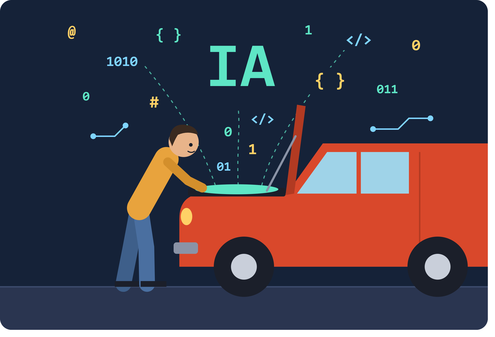
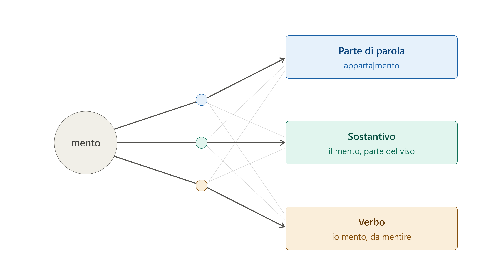

# Pagina informativa sull'IA

1. Perché questa pagina
2. Come funziona
3. Breve storia
4. Speranze
5. Timori
6. Preoccupazioni legate alla vita quotidiana
7. Tentativi di regolamentazione 
8. Glossario

## Perché questa pagina

Il perché è molto semplice: tutti i giorni leggiamo o ascoltiamo decine di notizie sull'Intelligenza Artificiale (IA), allarmi, cifre da capogiro, annunci da "fine del mondo" o, all'opposto, promesse di soluzioni ai grandi problemi del nostro tempo. Ma è molto difficile trovare una fonte che provi a spiegarci cosa c'è davvero "sotto il cofano" (*under the hood* direbbero gli americani). Questa scarsa conoscenza è il terreno migliore per coloro che hanno un forte interesse personale o aziendale nella propagazione di notizie che hanno scarso o nessun fondamento.

La complessità del tema rappresenta certamente un grosso ostacolo. Nell'IA c'è molta matematica e ingegneria informatica, materie per pochi esperti. Ma non è del tutto impossibile cercare di spiegare in modo divulgativo, a grandi linee ovviamente e con esempi molto semplificati, ciò che accade quando discutiamo con Gemini o con ChatGPT. In ogni caso, vale la pena fare un tentativo.
Cercheremo poi di raccontare come è nata l'IA e di riassumere alcuni dei temi che sono oggetto di dibattito quotidiano.

## Avvertenza iniziale

Questa pagina è stata scritta a partire dalla consultazione di diverse pagine web, di chat diverse IA (Gemini, ChatGPT, Claude) e grazie ad un libro di *Stefano Quintarelli* (con *Emil Abirascid*) dal titolo **La bolla dell'intelligenza artificiale** (editore Bollati Boringhieri, settembre 2026), di cui si consiglia la lettura a tutti gli interessati. Il layout della pagina (cioè il codice html e css che c'è dietro quello che state leggendo) è stato scritto da Claude sulla base delle indicazioni fornite dall'autore. Anche le immagini sono state elaborate da Claude.

## Come funziona

### 1. Una elaborazione statistica

Partiamo dalle basi. Detto in maniera estremamente semplificata, l'IA che usiamo nelle chat è una elaborazione statistica di frammenti di parole. Non "parole", si badi bene, ma **frammenti di parole**. Obiettivo: costruire frasi di senso compiuto calcolando il frammento **più probabile**. Uno dopo l'altro e uno alla volta.

### 2. I token

I frammenti vengono definiti **token**, un termine entrato ormai nell'uso comune. 

Facciamo subito un esempio. Usiamo la parola **appartamento**. Poniamo che la parola sia stata frammentata in due token (spiegheremo poi da *chi*, *come* e, soprattutto, *perché*): **apparta** e **mento**. "Mento" appare anche come parola a sé stante (il "mento" in senso anatomico e come voce del verbo "mentire") e poi in "ragionamento", "arredamento", "complemento", "avvicendamento", "esperimento", "frammento" e molto altro ancora. 

Prendiamo tre frasi:

1. Ho affittato un apparta|**mento** di tre stanze.
2. Si è tagliato il **mento** facendosi la barba.
3. Se ti dico che sto bene, **mento**.

Che cosa fa l'IA? 

1. Nella frase 1, "mento" *guarda* soprattutto "apparta", che lo precede, e poi "affittato" e "stanze". Risultato: è la coda di una parola che indica una casa.
2. Nella frase 2 *guarda* "tagliato" e "barba". Risultato: è una parte del viso.
3. Nella frase 3 *guarda* "dico" e "ti". Risultato: è un verbo, qualcuno non dice la verità.

Tutto qua?
Beh, non proprio. Teniamo presente che una IA generalista come ChatGPT, Gemini o Claude si basa su centinaia o migliaia di miliardi di parametri, addestrati su decine di migliaia di miliardi di token, risultato di miliardi di testi assorbiti (pagine web, riviste scientifiche, libri di ogni genere, in molte lingue). Quindi l'elaborazione avviene a partire da basi statistiche incredibilmente ampie. Molto più ampie di quanto sia mai stato concepito finora dall'essere umano. 

Tutto il testo che l'IA riesce a trasformare in parametri viene trasformato sostanzialmente in **una gigantesca rete di nodi interconnessi**, ispirati alle sinapsi delle reti neurali. I nodi corrispondono ai neuroni e le connessioni alle sinapsi.

Invece di leggere o elaborare il testo una parola alla volta, i modelli analizzano l'intera sequenza contemporaneamente, cogliendo le relazioni e il contesto globale.

### 3. Il *tokenizzatore*

Ma chi è che frammenta le parole in token? Risposta: è un software - in gergo definito **tokenizzatore** - elaborato dall'essere umano a partire da un algoritmo. 
Funziona così: l'essere umano decide le condizioni, ovvero quali testi usare come base, quanto deve essere grande il vocabolario (per esempio 100 mila token) e quale procedura applicare. L'algoritmo fa il lavoro: nessuno sceglie i token a mano. La procedura più diffusa parte dalle singole lettere, poi il software conta quali coppie compaiono più spesso vicine nei testi e le fonde in un nuovo frammento. Ripete l'operazione migliaia di volte: le lettere diventano sillabe, le sillabe pezzi di parola, i pezzi più comuni parole intere. Si ferma quando il vocabolario ha raggiunto la dimensione stabilita.

*Tutto è basato su un semplice conteggio di frequenze, senza alcuna "intelligenza"*. Per questo "mento" diventa un token: non perché qualcuno abbia riconosciuto un suffisso italiano, ma perché quelle cinque lettere compaiono insieme molto spesso. Solo a questo punto, con il vocabolario ormai fissato, comincia l'addestramento del modello vero e proprio, che impara a lavorare con quei token e non li cambia più.

Un'altra cosa importante da sapere: ad ogni frammento viene assegnato un numero identificativo. Perché **l'IA non legge parole ma *numeri***. Per esempio, "mento" potrebbe essere il numero 4.512 (attenzione: gli esempi non sono basati su software reali, servono solo a semplificare e aiutare a comprendere).
Il lavoro del tokenizzatore si svolge quindi in due direzioni:

- *In entrata:* prende la frase che viene scritta dall'utente durante una chat, la spezza in token consultando il suo vocabolario e passa all'IA la sequenza di numeri corrispondente.
- *In uscita:* l'IA risponde con altri numeri e il tokenizzatore li riconverte in testo leggibile.

### 4. Un frammento di parola che ne *guarda* un altro?

Abbiamo scritto: «Nella prima frase, "mento" *guarda* soprattutto "apparta", che lo precede, e poi "affittato" e "stanze". Risultato: è la coda di una parola che indica una casa».

Un attimo: *un frammento di parola che guarda un altro frammento?* Che storia è questa?

Beh qui c'è uno dei fatti più interessanti da sapere, un piccolo miracolo della conoscenza senza il quale l'IA non esisterebbe o non sarebbe quella che conosciamo oggi.

**Luogo:** Long Beach, California (USA).

**Occasione:** 31ª Conferenza sui sistemi di elaborazione delle informazioni neurali.

**Data:** 4-9 dicembre 2017.

Otto ricercatori di Google Research, Google Brain e Università di Toronto presentano un paper dal titolo **Attention Is All You Need** (l'attenzione è tutto ciò di cui hai bisogno). Undici pagine (di cui due di bibliografia) che introducono il concetto di Transformer. Una sorta di super-eroe, modello "Avenger", che cambia tutto. 

L'obiettivo era modesto: gli autori volevano migliorare la traduzione automatica e gli esperimenti del paper riguardano in particolare le traduzioni inglese-tedesco e inglese-francese. Che la stessa architettura potesse generare testi, scrivere codice o conversare non era all'orizzonte. Gli autori erano noti nell'ambiente ma certo non al grande pubblico. Il titolo è un gioco su "All You Need Is Love" dei Beatles, ed è rimasto così celebre che da allora centinaia di articoli scientifici si intitolano "... Is All You Need".

Ironia della sorte: il Transformer nacque in Google, ma fu OpenAI a sfruttarlo per prima fino in fondo, con GPT (2018) e poi ChatGPT (2022). Google dovette inseguire su una tecnologia inventata in casa. In seguito, quasi tutti gli otto autori hanno lasciato Google, molti per fondare proprie aziende di IA. Oggi il paper è tra gli articoli scientifici più citati del secolo.

### 5. Transformer, il super-eroe

Che cosa fa esattamente il Transformer? Diciamo innanzitutto che cosa facevano i software per la traduzione prima della comparsa del Transformer: come sembra ovvio, processavano le parole una per una, una frase dopo l'altra, in sequenza, cercando corrispondenze nel dizionario e nella grammatica, all'incirca come facciamo tutti noi alle prese con una traduzione da una lingua che conosciamo appena.

Gli otto ricercatori del paper hanno suggerito una strada completamente diversa: ogni parola deve "guardare" le parole che ha vicino e, in qualche modo, "imparare" da esse. 

> Scrive Quintarelli: "Se esaminiamo tutti i testi scritti sino a oggi, siamo in grado di stabilire una valutazione della frequenza con cui la parola «scuola» si trova vicino a ogni altra parola del dizionario. Siamo in grado cioè di misurare la frequenza con cui la parola «scuola» si trova vicino alle parole «auto», «lezione», «scoiattolo», «albero», «seriale», e così via. Per ogni parola nel prompt possiamo quindi creare una sequenza di valori (un vettore) che rappresenta la probabilità che tale parola sia relativa a ciascun'altra. Le parole «scooter» e «auto» avranno probabilità simili di essere vicine alle parole «strada», «ruota», «multa», «bollo» ecc., ma probabilità diverse di essere vicini alle parole «casco», «diesel», «caduta» ecc. In un certo senso, possiamo dire che queste sequenze di valori (vettori) prodotti con il word embedding «catturano il significato delle parole»; e, una volta che abbiamo questi vettori, possiamo fare operazioni incredibili!".

Il *word embedding* è il modo di trasformare ogni parola in una lista di numeri, che funzionano come coordinate su una mappa. La regola è che parole dal significato simile finiscono vicine: "gatto" accanto a "cane", "Roma" accanto a "Parigi", e tutte lontane da "bullone". Più coordinate ci sono, più sfumature si riescono a cogliere (genere, registro, ambito, tono).

Nei modelli linguistici attuali, le coordinate non sono fisse per ogni parola, ma vengono ricalcolate in base alla frase. Così "pesca" finisce in punti diversi se si parla di frutta o di canne e ami. L'*embedding* traduce le parole in coordinate, *in modo che la vicinanza nello spazio corrisponda alla vicinanza di significato*.

## Breve storia

Elenchiamo solo alcune tappe fondamentali.

### L'atto di nascita ufficiale

**31 agosto 1955.** Quattro ricercatori presentano una richiesta di finanziamento di 13.500 dollari alla Fondazione Rockefeller. Obiettivo: finanziare un seminario estivo di due mesi, nell'estate del 1956, durante i quali dieci studiosi avrebbero dovuto mettere assieme le proprie competenze e talenti, per lavorare ad una ricerca sull'intelligenza artificiale. Titolo del documento: *A Proposal for the Dartmouth Summer Research Project on Artificial Intelligence*. È [disponibile online](http://jmc.stanford.edu/articles/dartmouth/dartmouth.pdf), in formato pdf, nel sito dell'Università di Stanford. Quel documento è l'atto di nascita ufficiale dell'intelligenza artificiale, perché è lì che l'espressione compare per la prima volta. Gli autori:

- **John McCarthy**, giovane professore di matematica al Dartmouth College, il vero promotore
- **Marvin Minsky**, allora junior fellow a Harvard
- **Nathaniel Rochester**, progettista dell'IBM 701
- **Claude Shannon**, dei Bell Labs, già celebre come padre della teoria dell'informazione

#### L'idea di fondo

La proposta partiva da una congettura dichiarata: ogni aspetto dell'apprendimento, o di qualsiasi altra caratteristica dell'intelligenza, può in linea di principio essere descritto con tale precisione da poter costruire una macchina che lo simuli.

I temi elencati sono sorprendentemente attuali:

- far usare il linguaggio alle macchine
- le reti di neuroni
- la capacità di formare astrazioni e concetti
- l'auto-miglioramento
- il ruolo del caso nella creatività

#### Il nome

"Artificial intelligence" fu una scelta di McCarthy, in parte tattica. Voleva un'etichetta nuova, distinta dalla cibernetica di Norbert Wiener e dagli "studi sugli automi", che secondo lui portavano i ricercatori verso questioni troppo astratte e matematiche.

#### Il seminario

La Fondazione Rockfeller concesse circa 7.500 dollari. Il seminario si tenne nell'estate del 1956, ma non fu il lavoro collettivo immaginato: i partecipanti andavano e venivano, ognuno con la propria agenda. Non ne uscì una svolta tecnica. Ne uscirono però un nome, una comunità di ricercatori e un programma di ricerca che avrebbe dominato i decenni successivi. 

### Sessant'anni di entusiasmi e delusioni

Seguono sessant'anni in cui si alternano entusiasmi e delusioni. In particolare, l'idea delle reti neurali  viene data per morta due volte.

#### 1956–1973
#### Gli anni dell'entusiasmo

Dopo Dartmouth domina l'IA "simbolica": l'intelligenza come manipolazione di simboli secondo regole logiche. I finanziamenti arrivano soprattutto dalla difesa americana (ARPA) e le promesse sono enormi: Herbert Simon prevede nel 1965 che entro vent'anni le macchine sapranno fare qualsiasi lavoro umano.

- **1958**: Frank Rosenblatt presenta il Perceptron, un neurone artificiale che impara dagli esempi. È la strada alternativa, quella delle reti neurali.
- **1966**: Joseph Weizenbaum crea ELIZA, il primo chatbot, che imita uno psicoterapeuta con semplici trucchi di riformulazione. Lo stupore di chi lo usa spaventa il suo stesso autore.
- **1969**: Minsky e Papert pubblicano *Perceptrons*, dimostrando i limiti matematici delle reti a un solo strato. La ricerca sulle reti neurali si ferma quasi del tutto.

#### 1974–1980
#### Il primo inverno

Le promesse non si avverano. Il rapporto ALPAC (1966) boccia la traduzione automatica, il rapporto Lighthill (1973) convince il governo britannico a tagliare i fondi, e ARPA fa lo stesso. Si scopre che ciò che è facile per un bambino, come riconoscere un volto o capire una frase, è difficilissimo per una macchina.

#### Anni Ottanta
#### I sistemi esperti e il secondo inverno

L'IA rinasce in versione commerciale con i "sistemi esperti": programmi che racchiudono in migliaia di regole il sapere di uno specialista. Il Giappone lancia nel 1982 il progetto dei computer di "quinta generazione". Ma questi sistemi sono costosi, rigidi e incapaci di imparare: a fine decennio il mercato crolla.

Intanto, quasi inosservato, nel **1986** Rumelhart, Hinton e Williams rendono popolare la *retropropagazione*, il metodo per addestrare reti a più strati. È la risposta all'obiezione di Minsky, ma mancano ancora dati e potenza di calcolo.

#### Anni Novanta e Duemila
#### La svolta statistica

Si smette di scrivere regole a mano e si lascia che le macchine le ricavino dai dati.

- **1997**: Deep Blue di IBM batte Kasparov a scacchi (con forza bruta, più che con apprendimento). Lo stesso anno Hochreiter e Schmidhuber inventano le reti LSTM, capaci di "ricordare" sequenze.
- **2009**: Fei-Fei Li costruisce ImageNet, milioni di immagini etichettate.

#### 2012–2016
#### L'esplosione del deep learning

- **2012**: AlexNet, la rete di Krizhevsky, Sutskever e Hinton, stravince la gara ImageNet usando le schede grafiche dei videogiochi (GPU). Da qui tutti passano alle reti neurali profonde.
- **2014**: Bahdanau, Cho e Bengio introducono l'*attenzione*: nel tradurre, la rete impara a "guardare" le parole rilevanti della frase d'origine.
- **2016**: AlphaGo di DeepMind batte Lee Sedol a Go, e Google Translate passa alle reti neurali.

#### 2017
#### Il Transformer

Le reti per il linguaggio avevano un limite: leggevano il testo una parola alla volta, in sequenza. Erano quindi lente da addestrare e tendevano a perdere il filo nelle frasi lunghe.

Nel giugno 2017 otto ricercatori di Google pubblicano *Attention Is All You Need*, presentato a dicembre alla conferenza NIPS di Long Beach, in California. La proposta è eliminare la lettura sequenziale e tenere solo l'attenzione: ogni parola viene messa in relazione con tutte le altre contemporaneamente.

Le conseguenze sono due:

1. Il modello coglie meglio i legami a distanza nel testo.
2. Il calcolo si può distribuire in parallelo su molte GPU, quindi si possono addestrare modelli enormemente più grandi su quantità di testo prima impensabili.

Gli autori pensavano alla traduzione automatica. Nel giro di un anno su quell'architettura nascono BERT e il primo GPT: la "T" sta appunto per Transformer.

In questi anni l'IA esce dai laboratori: la storia tecnica continua, ma diventa anche storia industriale, politica e di costume.

#### 2018–2020
#### I modelli pre-addestrati

Sul Transformer nasce un nuovo metodo di lavoro: prima si addestra un modello su enormi quantità di testo, senza un compito preciso, poi lo si adatta agli usi specifici.

- **2018**: escono GPT di OpenAI e BERT di Google. Il primo impara a prevedere la parola successiva, il secondo a indovinare parole nascoste in una frase. BERT entra presto nel motore di ricerca di Google.
- **2019**: GPT-2 scrive testi così plausibili che OpenAI ne ritarda la pubblicazione completa, temendo abusi. È il primo dibattito pubblico sui rischi di questi modelli.
- **2020**: GPT-3, con 175 miliardi di parametri, mostra una cosa inattesa: non serve più riaddestrarlo, basta spiegargli il compito a parole. Nasce il *prompt*.

Si afferma così l'idea che guiderà gli investimenti successivi: modelli più grandi, con più dati e più calcolo, acquisiscono capacità nuove.

Sempre nel 2020, AlphaFold 2 di DeepMind risolve in gran parte il problema della struttura delle proteine, aperto da cinquant'anni: è il primo grande risultato scientifico dell'IA.

#### 2021–2022
#### L'IA generativa arriva al pubblico

- **2021**: GitHub Copilot comincia a scrivere codice accanto ai programmatori.
- **2022**: DALL-E 2, Midjourney e Stable Diffusion generano immagini da una descrizione testuale.
- **30 novembre 2022**: OpenAI pubblica ChatGPT. La tecnologia non era nuova, ma lo era l'interfaccia: una semplice chat, gratuita. Raggiunge circa cento milioni di utenti in due mesi.

#### 2023
#### La corsa e le prime regole

- Esce GPT-4, e in pochi mesi arrivano i concorrenti: Bard (poi Gemini) di Google, Claude di Anthropic, Llama di Meta, quest'ultimo distribuito liberamente.
- A marzo una lettera aperta firmata da migliaia di ricercatori e imprenditori chiede una pausa di sei mesi nello sviluppo. Non verrà ascoltata.
- Sempre a marzo il Garante italiano per la privacy blocca temporaneamente ChatGPT: è il primo provvedimento del genere in un paese occidentale.
- A novembre si tiene a Bletchley Park il primo vertice internazionale sulla sicurezza dell'IA.

#### 2024
#### Multimodalità, Nobel e AI Act

- I modelli diventano *multimodali*: leggono immagini, ascoltano, parlano.
- Compaiono i modelli "che ragionano", cioè che elaborano il problema passo per passo prima di rispondere.
- L'Unione Europea approva l'AI Act, la prima legge organica al mondo sul tema, in vigore dal 1° agosto.
- A ottobre arriva la consacrazione accademica: il Nobel per la fisica va a John Hopfield e Geoffrey Hinton per le reti neurali, quello per la chimica a Demis Hassabis e John Jumper per AlphaFold (insieme a David Baker).

#### 2025–2026
#### Gli agenti

- A gennaio 2025 la cinese DeepSeek pubblica un modello competitivo a costi molto inferiori, mostrando che la corsa non è solo americana.
- A settembre 2025 l'Italia approva la propria legge quadro sull'intelligenza artificiale (legge n. 132).
- Il passaggio decisivo è dal chatbot all'*agente*: un sistema che non si limita a rispondere, ma svolge compiti in più passaggi, cercando sul web, scrivendo ed eseguendo codice, usando programmi.

